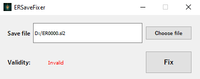
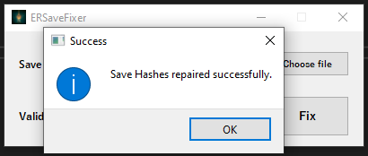
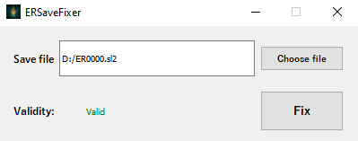

### 🔧🔨🔄 Elden Ring Corrupt Save Fixer (SteamID MD5 repair) / Save Verifier 🔄🔨🔧

### How it works 📋
- Run the binary file
- Choose SL2 save
- Fix if save valid

### Screenshots

### Building 🛠️
- You will need Visual Studio 2017 or higher and just open the .sln file

### Shoutouts
Big shoutout to [soarqin](https://github.com/soarqin) because i was heavily inpspired by his repo: [ERSavMan](https://github.com/soarqin/ERSavMan)
